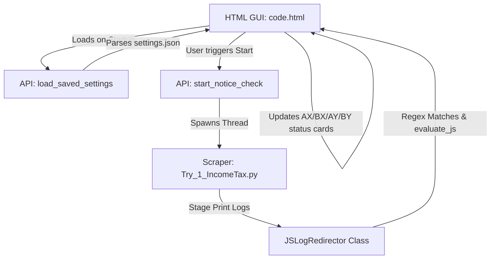

# Litigation OS — Custom Progress, Character Crawling & UI Enhancements Walkthrough

We have successfully implemented configuration persistence, mapped precise progress bar stages, added an animated crawling character with thought bubbles, and restructured the right panel layout with a live Progress Window and collapsible Security Log.

---

## 💻 Key Features Added

### 1. Persistent Configuration Settings (`settings.json`) ✅
- **Persistence**: Added auto-save hooks when selecting paths inside `browse_credentials()` and `browse_destination()`. Selected folders/spreadsheets are written immediately to `settings.json` next to the executable.
- **Auto-loading**: On application launch, settings are parsed and populated back into the input forms, fetching client cards automatically. Fallback to local `Credentials.xlsx` remains in place if no saved configurations exist.

### 2. Precise Dual Progress Ticker Stages ✅
- **Secure Authentication (Bar 1)**:
  - **25%**: Login the portal initiated
  - **50%**: User ID entered and Continue Clicked
  - **75%**: Password entered and Login Clicked
  - **100%**: Portal loaded and e-Proceedings page opened
- **Notice Aggregation (Bar 2)**:
  - **25%**: AX File downloaded
  - **50%**: BX File downloaded
  - **75%**: AY File downloaded
  - **100%**: BY File downloaded and Logout completed (restarts for the next client session)

### 3. Sideways Crawling Character & Thought Loops ✅
- **Crawling Character**: An inline SVG cute insect crawler with keyframe leg crawl rotation (`leg-left`, `leg-right`) and bobbing body animations crawls sideways, pinned directly to the right edge of both progress bar fills.
- **Dynamic Thoughts**: A floating speech bubble updates thoughts based on progress stages:
  - *Auth Stage*: "Login the portal...", "Used ID and Continue Clicked...", "Password Input and Login Clicked...", "Portal loaded and Eproceedings Page has been opened!"
  - *Extraction Stage*: "AX File downloaded...", "BX File downloaded...", "AY File downloaded...", "BY File downloaded and Logout completed!"

### 4. Right Panel Restructuring ✅
- **Progress Window Panel**: Added a status dashboard for the active client showing:
  - Active client taxpayer name and PAN card.
  - Interactive grid cards for AX, BX, AY, BY file download states (Pending, Downloaded, No Records, Failed) with color-coded borders and text.
  - Live summary box displaying success/reconciliation messages upon completion: `Successfully downloaded and saved the Records for [Name]`.
- **Collapsible Security Log**: Renamed the Transaction Ledger to "Security Log". It is minimized (height: 0px) at the bottom, and can be toggled open or closed with smooth CSS height transitions by clicking its header.

---

## ⚙️ Architecture Blueprint

---

## 📦 Size and Compilation Audit ✅

- **Binary Size**: Optimized to **99.2 MB** (well under the 103MB size footprint constraint).
- **Executable**: Rebuilt cleanly into `dist/LitigationOS.exe` using `IncomeTaxNoticeChecker.spec`.
- **Exclusions**: Kept Pandas, openpyxl, pyzipper, and NumPy hidden imports intact, while excluding unused heavy libraries like Torch and OpenCV.
