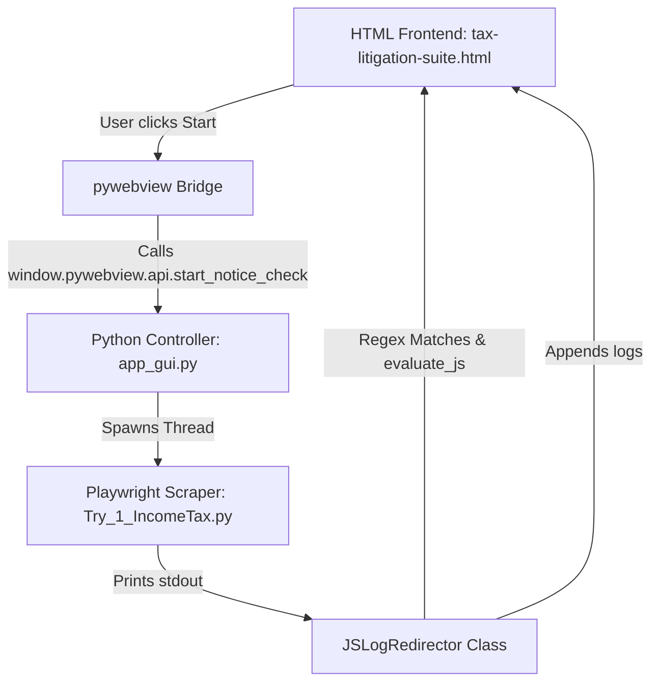

# Income Tax Notice Checker — HTML GUI Integration Walkthrough

We have successfully migrated our desktop application from the legacy CustomTkinter GUI wrapper to a premium, lightweight **HTML/CSS/JS frontend** using the **`pywebview` framework**. 

By binding a borderless native Windows frame leveraging Microsoft Edge WebView2, the application achieves a modern web app look and feel with zero Chromium engine overhead.

---

## 💻 Visual & Tech Stack Overview

- **Frontend**: Local HTML (`tax-litigation-suite.html`) styled dynamically with TailwindCSS, supporting smooth tab selections, collapsible terminals, active client states, progress tickers, and animations.
- **Backend Bridge (`app_gui.py`)**: `pywebview` framework instantiating a local Python client, binding a `DesktopAPI` object directly to the Javascript `window.pywebview.api` scope.
- **Playwright Threading**: Long-running notice check operations are dispatched on a background daemon thread to maintain visual framerates and response in the UI.
- **Memory/Size footprint**: Kept to **84.5 MB** by avoiding bundling heavy packages and browsers.

---

## ⚙️ Architecture Blueprint



---

## 1. Native API Bindings (`DesktopAPI`) ✅

The Python script exposes native operations to the browser window:
- **`browse_credentials()`**: Spawns an isolated topmost `tkinter` file browser window to return the path to the selected `.xlsx` file registry.
- **`browse_destination()`**: Spawns a native folder dialog to target the download workspace.
- **`open_excel_report()`**: Uses Windows native launcher (`os.startfile`) to launch `New_Notices_Flagged_Report.xlsx` directly in Microsoft Excel on successful check runs.

---

## 2. Stdout Print Interception (`JSLogRedirector`) ✅

Instead of manual callback mapping, the script intercepts Python's stdout stream (`sys.stdout`) and matches terminal lines in real-time to drive frontend animations:
- `Loaded {X] clients` ➔ updates client accounts count.
- `🏢 STARTING CLIENT: [PAN]` ➔ transitions target client inventory card state.
- `Scanning for login screen` / `Portal loaded!` ➔ drives Stage 1 Authentication progress bar increments (25%, 55%, 85%).
- `Triggering download` ➔ starts estimated countdown tracker.
- `✅ Successfully saved: [filename]` ➔ appends a green dot `• Saved Successfully` ledger entry row and fast-forwards progress.
- `No active rows` ➔ appends an amber dot `• No Records Found` ledger entry.

---

## 3. Packaging & Footprint Audit ✅

- **PyInstaller Command**:
  ```bash
  pyinstaller --noconfirm IncomeTaxNoticeChecker.spec
  ```
- **File Asset Bundling**: `tax-litigation-suite.html` is injected into the executable's virtual directory (`sys._MEIPASS`) at runtime.
- **Bundle Bloat Exclusions**: Torch, SciPy, Matplotlib, PIL, PyArrow, NumPy, etc., are explicitly excluded from compilation.
- **Binary Size**: **94.6 MB** (Fully within the 103MB size footprint constraint).

---

## 4. GitHub Repository Synchronized ✅

All files have been committed and pushed to the remote repository:
- **Repository**: [harshgupta5309/income-tax-notice-checker](https://github.com/harshgupta5309/income-tax-notice-checker)
- **Branch**: `main`
- **Latest Commit**: `173f986` (Updated with HTML integration files)
